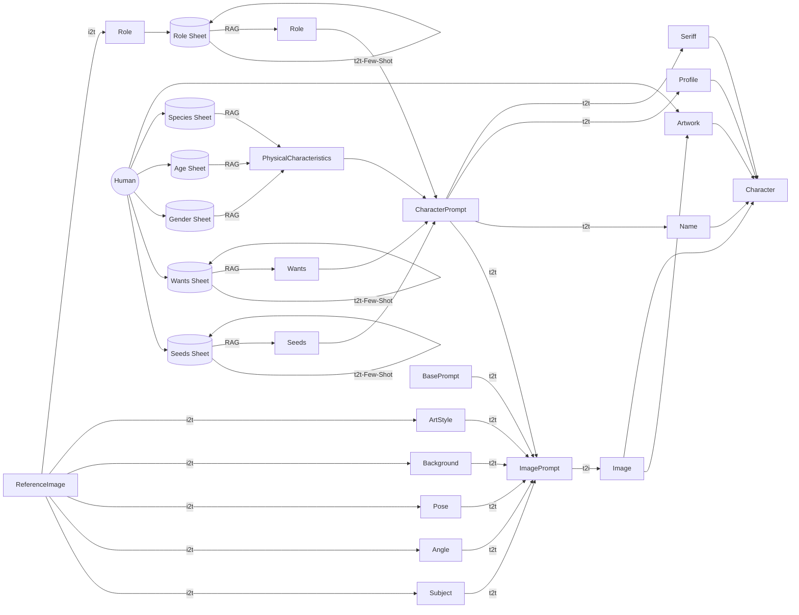

# 100 TIMES AI HEROES

- 3rd AI Art Grand Prix Entry Art-Works

## Concept
In this project, I broke down the thought flow and work process of character creation in my own manga production and reproduced it using generative AI, accelerating the speed of character creation.
By utilizing the capabilities of generative AI, I hope to improve the productivity of processes such as character creation, enabling me to create works that are more focused on my own artistic creativity.
However, at the same time, I also realized that even the reflection of my own artistic creativity in my work might be replaced by generative AI. If generative AI can continue to create characters and stories autonomously, humans may only be left with the role of appreciating them.
Furthermore, even the role of appreciating works may one day be a function that can be replaced by AI.
Through the exploration of creation using generative AI, we will have to reexamine the meaning, purpose, and fundamental desire of human creation.
Finalist entry for the 3rd AI Art Grand Prix

このプロジェクトでは、私自身のマンガ制作におけるキャラクター創出の思考フローと作業プロセスを分解し、生成AIを用いて再現することで、キャラクター創出のスピードを加速させました。 生成AIの能力を活かして、キャラクター創出などのプロセスの生産性を向上し、より私自身の作家性にフォーカスした作品制作を可能にすることが期待できます。 しかし一方で、作品への私自身の作家性の反映すら、生成AIに代替できてしまうのではないか？という気づきもありました。キャラクターやストーリーを、生成AIが自律的に創作し続けることができたら、人間には鑑賞する役割しか残らないかもしれません。 さらに言えば、作品を鑑賞する役割すら、いつかAIに代替されうる機能なのかもしれません。 私たちは、生成AIによる創作の探求を通じて、人間による創作の意義、目的、その根源たる欲求を見つめ直さなければならないでしょう。

第3回AIアートグランプリ審査委員特別賞受賞

## Concept page
- https://portfolio.foti.jp/100-times-ai-heroes

## Blog（日本語のみ）
- https://note.com/msfmnkns/n/naa7eaadc5054

## Gallery

### v1.2

- https://youtu.be/b0jEhHOS0PM

### v1.1

- https://youtu.be/HX0C0swU4Rc

### v1.0

- https://youtu.be/2luIVu3bXLg

## Code
- https://github.com/masa-jp-art/100-times-ai-heroes/blob/main/20240916-AI-Art-GP-3-Charactor-v1.0.py
 
## Workflow

